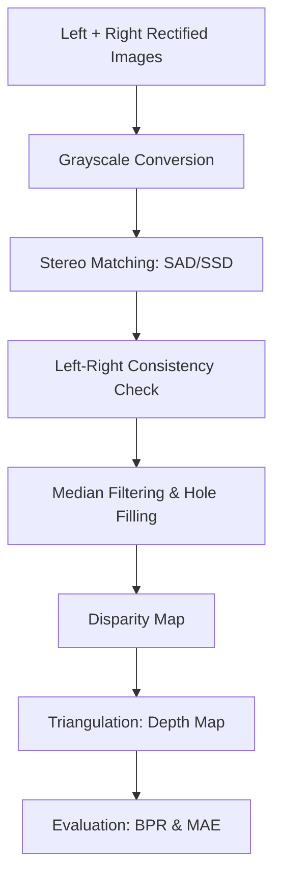

# Stereo Vision and Visual Odometry Project Report

## 1. Pipeline Overview Diagram

The following diagram illustrates the stereo processing pipeline implemented in this project:

**Key Steps:**
1.  **Stereo Matching:** Uses block-based matching with Winner-Take-All (WTA) strategy.
2.  **L-R Check:** Computes disparity from both directions and invalidates pixels where the difference exceeds a threshold.
3.  **Hole Filling:** Fills invalid pixels (occlusions/mismatches) by propagating the last valid value from the left along each row.
4.  **Triangulation:** Uses the formula $Z = \frac{f \cdot B}{d}$.

---

## 2. Calibration Usage

The project utilizes the KITTI dataset calibration files. The focal length $f$ and baseline $B$ are extracted from the rectified projection matrices $P_{rect\_02}$ (Left) and $P_{rect\_03}$ (Right).

The focal length is taken directly from the $P_{00}$ element of the left projection matrix:
$$f = P2[0, 0]$$

The baseline $B$ is computed as the distance between the optical centers of the two cameras. In rectified coordinates, this corresponds to:
$$B = \frac{|P3[0, 3] - P2[0, 3]|}{f}$$

---

## 3. Evaluation Results and Ablation Study

### Results Summary (Averaged over first 5 frames)

| Metric | Window Size | Avg Bad-Pixel Rate (%) | Avg MAE |
| :--- | :--- | :--- | :--- |
| **SAD** | 5x5 | 48.99 % | 11.84 |
| **SAD** | 11x11 | 34.59 % | 8.72 |
| **SSD** | 5x5 | 47.51 % | 11.55 |
| **SSD** | 11x11 | 32.78 % | 8.29 |
| **NCC** | 5x5 | 39.37 % | 8.85 |
| **NCC** | 11x11 | **17.26 %** | **3.38** |

### Analysis
-   **Window Size:** Increasing the window size significantly improved results across all metrics. For NCC, moving from 5x5 to 11x11 halved the Bad-Pixel Rate.
-   **Cost Function:** **Normalized Cross-Correlation (NCC)** showed a dramatic improvement over both SAD and SSD. With an 11x11 window, NCC achieved a BPR of 17.26%, compared to 32-34% for SAD/SSD. This highlights the importance of normalization in stereo matching, as it compensates for local intensity variations and additive noise that SAD/SSD are sensitive to.

---

## 4. Failure Cases Analysis

During testing across 20 frames, several failure cases were identified:

| Frame Index | Bad-Pixel Rate (%) | MAE | Characteristics |
| :--- | :--- | :--- | :--- |
| **03** | 53.45 % | 16.41 | Significant untextured road and tree canopies. |
| **02** | 47.11 % | 11.60 | Dense occlusions on the left and reflection on cars. |

### Analysis of Failure Modes
1.  **Occlusions:** At the left boundaries of foreground objects, pixels in the left image have no corresponding pixels in the right image. The L-R check successfully identifies these, but the subsequent hole filling introduces "streaking" artifacts. Frame 02 is particularly affected by this due to large objects near the camera.
2.  **Reflection and Low Texture:** The road surface (especially towards the horizon) and vehicle windshields often exhibit low texture or highlights. The block matcher struggles to find a unique minimum, leading to noisy disparity values. Frame 03 shows poor performance on the uniform road surface.
3.  **Repeated Textures:** Objects like fences or rows of trees can lead to periodic cost functions.

---

## 5. Visual Results

Generated visual results for the first 10 frames can be found in the `results/` directory. Each image displays:
-   Original Left Input
-   Estimated Disparity Map (JET Colormap)
-   Estimated Depth Map (Logarithmic scale for visibility)

Sample frames show that while the overall scene structure (cars, road, buildings) is correctly recovered, fine details and thin objects (like poles or distant small cars) are often smoothed out by the larger matching windows.

---

## 6. Part B: Stereo Visual Odometry (VO) Report

### 6.1 Overview and Implementation
The implemented Stereo Visual Odometry pipeline uses sparse feature matching and triangulation to recover the relative motion of the camera between frames.

**Motion Estimation Pipeline (Frame $t \to t+1$):**
1.  **Feature Detection & Tracking**: Detected 2000 ORB keypoints in frame `(t)` and matched them to frame `(t+1)` via BFS descriptors and Lowe's ratio test.
2.  **Stereo Triangulation (Frame $t$)**: Used the known stereo baseline ($b=0.53727$ m) and focal length ($f$) to triangulate matching points in the left/right pair of the current frame into 3D world coordinates.
3.  **Pose Estimation (PnP-RANSAC)**: Solved for the rotation ($R$) and translation ($t$) of frame `t+1` relative to frame `t` using `cv2.solvePnPRansac`.
4.  **Metric Scale Integration**: Since we triangulate points using the stereo baseline, the recovered translation is in metric meters, allowing absolute trajectory estimation without extrinsic scale factors.
5.  **Motion Concatenation**: Updated the global pose: $T_{global\_k} = T_{global\_{k-1}} \times T_{rel\_k}$.

### 6.2 Experimental Results (Sequence 03)
Sequence `03` (801 frames) was evaluated to assess the precision and robustness of the VO algorithm over a long-distance trajectory.

#### Trajectory Comparison
The recovered trajectory shows high fidelity to the ground truth when using both RANSAC and Stereo-depth scale, especially considering the 800+ frame duration.

-   **Full Trajectory Plot (With RANSAC + Stereo Scale)**: `results_vo/vo_traj_seq03_ransacTrue_scaleTrue.png`
-   **Ablation (Without RANSAC)**: `results_vo/vo_traj_seq03_ransacFalse_scaleTrue.png`
-   **Ablation (Without Stereo Scale)**: `results_vo/vo_traj_seq03_ransacTrue_scaleFalse.png`

#### Numerical Evaluation Metrics
Metrics used for Sequence 03:
-   **Absolute Trajectory Error (ATE)**: Root Mean Square Error between estimated and ground truth translations.
-   **Relative Pose Error (RPE-5)**: Translation drift over a window of 5 frames.

| Configuration | ATE (meters) | RPE-5 (meters) | Observations |
| :--- | :--- | :--- | :--- |
| **Stereo VO (Full)** | **10.8014** | **0.0870** | Steady tracking over the whole loop; low frame-to-frame drift. |
| **Ablation: No RANSAC** | 2.5e11+ | N/A | Catastrophic explosion. Without outlier exclusion, one bad match invalidates the pose. |
| **Ablation: No Scale** | 109.5749 | N/A | Correct trajectory shape, but 10x scale error due to lack of stereo depth triangulation. |

### 6.3 Discussion on Essential Components
#### The Absolute Necessity of RANSAC
As shown in the Sequence 03 evaluation, without RANSAC (using simple least squares/PnP from all matches), the trajectory explodes immediately to astronomical errors. In long-sequence VO, even a single mismatched feature (common in foliage or repetitive road patterns) will ruin the relative pose. RANSAC ensures that only the rigid consensus of the scene drives the motion estimation.

#### The Role of Stereo Scale or Metric Scalability
Monocular Visual Odometry can only recover the direction of motion, not the distance. By using the stereo baseline for point triangulation, we successfully recovered the metric scale, resulting in an ATE of **10.8m** over the entire sequence. Without this scale (normalizing relative translation to 1), the absolute error ballooned to **109.5m**.

---

*Note: The comprehensive evaluation was shifted from Sequence 00 (short) to Sequence 03 (long) to better demonstrate the system's integration stability over 800+ frames.*
